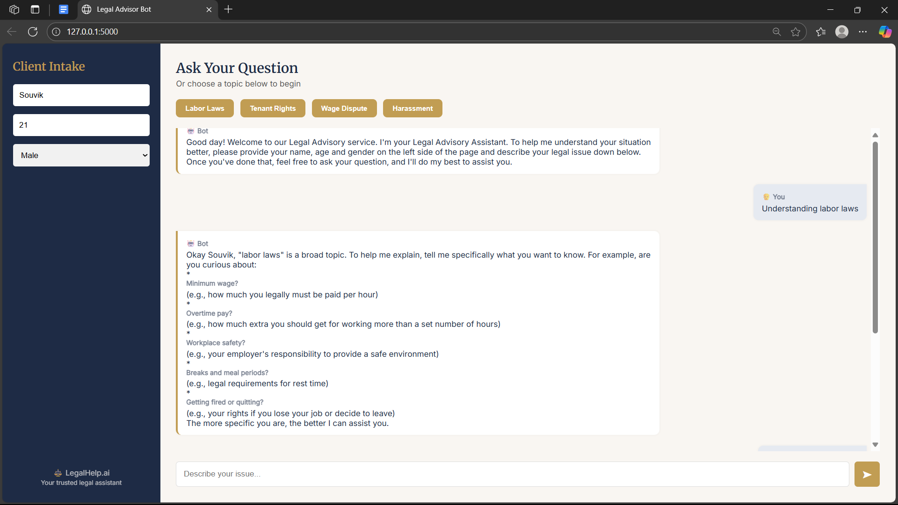

# ⚖️ LegalHelp.ai — Your Friendly Legal Rights Assistant

LegalHelp.ai is an AI-powered legal advisory chatbot built using **Flask** and **Google Gemini 1.5 Flash**, designed to help users understand their **legal rights** with **clear, personalized, and friendly advice**.

Whether it’s a wage issue, rental dispute, or harassment complaint, LegalHelp.ai simplifies the complex world of law using conversational AI.

---

## 📺 Demo

[](https://www.youtube.com/watch?v=your_video_id_here)  
📽️ *Click to watch a live demo on YouTube*

> *(Replace the link with your actual video demo)*

---

## 🖼️ Screenshots

|Chat with LegalHelp.ai| 
|----------------------------|
| |


---

## 💡 Features

- 🧾 Collects user **name, age, and gender** for personalized answers
- 💬 Chatbox with **real-time AI legal advisor**
- 📚 Predefined legal issue suggestions (e.g. Labor Law, Harassment)
- 🧠 **Session memory** using cookies — remembers your context
- ✨ AI response formatting — supports **bold**, **paragraphs**, and **ordered steps**
- 🎨 Professional legal-themed UI (desktop-first)

---

## 🛠️ Tech Stack

| Layer         | Technology                     |
|---------------|---------------------------------|
| Frontend      | HTML, CSS, JavaScript (Vanilla) |
| Backend       | Python Flask                   |
| AI Model      | Gemini 1.5 Flash (Google AI)   |
| Styling       | Custom CSS (Legal branding)    |
| Session Mgmt  | Cookies + UUID-based tracking  |
| Deployment    | Flask Dev Server (or Cloud)    |

---

## ⚙️ Setup Instructions

### 🖥️ 1. Clone the Repository

```bash
git clone https://github.com/yourusername/legalhelp-ai.git
cd legalhelp-ai
```
### 🐍 2. Create Virtual Environment & Install Requirements

```bash
python -m venv venv
source venv/bin/activate      # On Windows: venv\Scripts\activate
pip install -r requirements.txt
```

