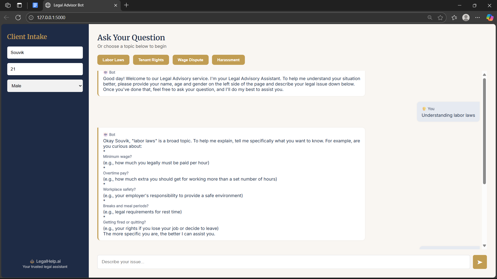

# ⚖️ LegalHelp.ai — Your Friendly Legal Rights Assistant

LegalHelp.ai is an AI-powered legal advisory chatbot built using **Flask** and **Google Gemini 1.5 Flash**, designed to help users understand their **legal rights** with **clear, personalized, and friendly advice**.

Whether it’s a wage issue, rental dispute, or harassment complaint, LegalHelp.ai simplifies the complex world of law using conversational AI.

---

## 📺 Demo

[Watch the Video](https://drive.google.com/file/d/1xkERfRjjIaz_kUYUlOvfZeCfeZ1tyyTc/view?usp=sharing)


---

## 🖼️ Screenshots

|Chat with LegalHelp.ai| 
|----------------------------|
| |


---

## 💡 Features

- 🧾 Collects user **name, age, and gender** for personalized answers
- 💬 Chatbox with **real-time AI legal advisor**
- 📚 Predefined legal issue suggestions (e.g. Labor Law, Harassment)
- 🧠 **Session memory** using cookies — remembers your context
- ✨ AI response formatting — supports **bold**, **paragraphs**, and **ordered steps**
- 🎨 Professional legal-themed UI (desktop-first)

---

## 🛠️ Tech Stack

| Layer         | Technology                     |
|---------------|---------------------------------|
| Frontend      | HTML, CSS, JavaScript (Vanilla) |
| Backend       | Python Flask                   |
| AI Model      | Gemini 1.5 Flash (Google AI)   |
| Styling       | Custom CSS (Legal branding)    |
| Session Mgmt  | Cookies + UUID-based tracking  |
| Deployment    | Flask Dev Server (or Cloud)    |

---

## ⚙️ Setup Instructions

### 🖥️ 1. Clone the Repository

```bash
git clone https://github.com/yourusername/legalhelp-ai.git
cd legalhelp-ai
```
---

### 🐍 2. Create Virtual Environment & Install Requirements

```bash
python -m venv venv
source venv/bin/activate      # On Windows: venv\Scripts\activate
pip install -r requirements.txt
```
---

### 🔐 3. Set Up Environment Variables
Create a .env file based on .env.sample:
```bash
FLASK_SECRET_KEY=your-secret-key
GEMINI_API_KEY=your-google-api-key
```
 Don’t commit this .env file to GitHub!

---

### ▶️ 4. Run the App
```bash
python app.py
```
Then visit: **http://localhost:5000**
---

### 🧪 Sample Use Cases
Try asking:

|**“What are my rights as a tenant if my landlord enters without notice?”**

|**“I wasn't paid for my overtime work, what should I do?”**

|**“Can I file a harassment complaint anonymously?”**

---

### 📁 Project Structure
```bash
legalhelp-ai/
│
├── static/
│   ├── index.static.js        → Frontend JS logic
│   ├── style.css              → UI styling
│   └── screenshots/           → UI screenshots
│
├── templates/
│   └── index.html             → Main chat interface
│
├── .env.sample                → Environment variable template
├── app.py                     → Flask backend with session handling
├── requirements.txt           → Python dependencies
├── README.md                  → This file
└── .gitignore                 → Ignores .env, __pycache__, etc.
```
---

### 🧠 Powered By
-> Gemini 1.5 Flash
-> Flask
-> Google Generative AI SDK

---

👨‍💻 Contributors

Souvik Halder📫 [hsouvik605@gmail.com] | Kunal Guha 📫 [kunalguh2003@gmail.com] | Subhadip Bag📫 [subhadipbag906@gmail.com]


---


📝 License
Licensed under the MIT License — free to use, improve, and share.


⭐ Star, Fork, & Contribute
If this project helped spread awareness or simplified complex information:


⭐ Star the repo to show support

🍴 Fork it to improve or localize it

🐛 Submit issues or suggestions
